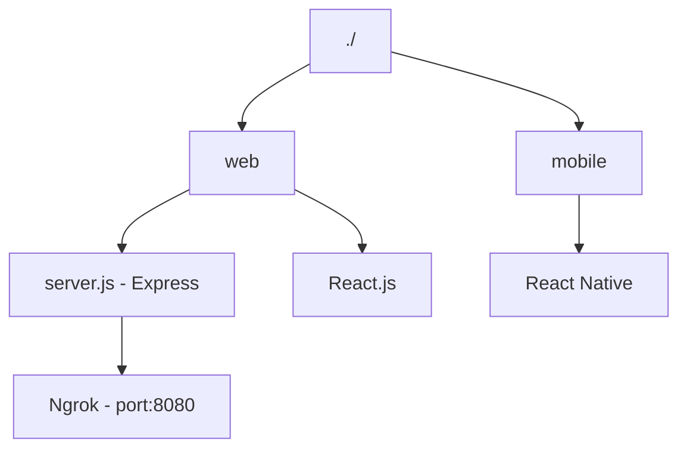

# Welcome to Video chat App

This is a simple **peer to peer** video chat application demo I created. I have used an express server residing in the web folder. React js is used in for the browser interface for the video chat. The mobile folder contains Native React for file use to build an android app. Follow the steps to get it running.

# Prerequisite

- [Node.js](https://nodejs.org/en/)
- [Npm](https://www.npmjs.com/get-npm)
- [React.js](https://reactjs.org)
- [React Native](https://reactnative.dev)
- [Ngrok](https://ngrok.com)

## Project flow diagrams

## Setting up ## the backend with Express and Ngrok
 `cd web` and run following:
1. `npm install` to  installs node packages
2. `node server.js` starts the express server
3. It will start on port `8080` on your machine 
4. If you wish to change it, you can do I in the `web/server.js` file
5. line `10 const  port = 8080`
6. Connect port `8080` (or any other u link) to ngrok use this link to know how [link](https://ngrok.com)
7. Copy link id (eg. `https://432971854b19.ngrok.io`  copy the `432971854b19`)

## Setting up React.js
1. in the `web\app.js` file find the line `'https://<link id>.ngrok.io/webrtcPeer'`
2. Replace `<link id>` with the copied id (eg `432971854b19`)
3. Start  a new terminal window and run npm start to run react js

You can use the localhost link in two different browsers to test call and answer of the video stream.

## Setting up React native 
1. On a new terminal `cd` in the `./mobile` folder.
2. Run `npm install` to  installs node packages
3. Make sure u have the correct android environment set up.
4. When u run the app paste the server id in the text field on the app.
5. You can call another pear.
6. When you receive a call the answer button will change color

Enjoy the app!